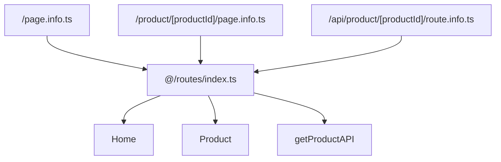
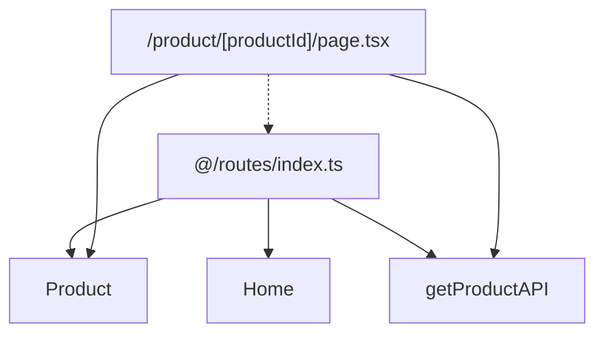
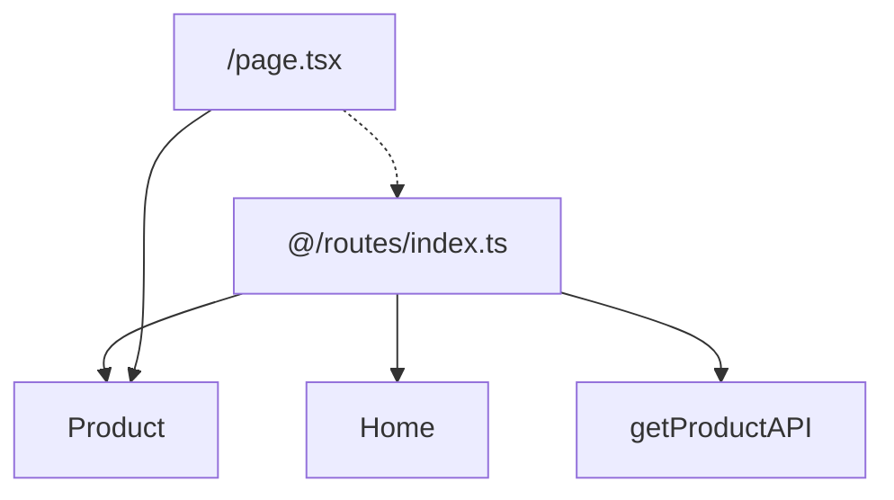

## NextJS Typesafe Routing

`next-tsr` sets up an optional typesafe routing system for NextJS. It maintains a global list of both pages and API routes and provides components and functions to easily navigate to pages, or make API requests.

## Installation

Initialize your NextJS application:

```bash
npx next-tsr init
```

This will generate an `@/routes` directory that you can use to navigate to pages and make API requests. It also generates a `NEXT-TSR-README.md` file in the root of your project that contains information about how to use the system.

You can update the files when the route paths change using the `build` command. This will update the `@/routes` directory to reflect the new paths. For example, if you add a new page, you can run the following command to update the routes:

```bash
npx next-tsr build
```

## Using Links To Pages Routes

Instead of doing this:

```tsx
import Link from "next/link";

<Link href={`/product/${product.id}`}>Product</Link>;
```

You can do this:

```tsx
import { ProductDetail } from "@/routes";

<ProductDetail.Link productId={product.id}>Product</ProductDetail.Link>;
```

## Using API Routes

API routes are fully typesafe. Instead of doing this:

```tsx
// Data is any
const data = await fetch(`/api/product/${productId}`).then((res) => res.json());
```

You can do this:

```tsx
import { getProduct } from "@/routes";
// Data is strongly typed as the response of the getProduct function
const data = await getProduct({ productId });
```

And both the request and the response are strongly typed.

## OpenAPI Support

Because the system knows all of the API routes, their verbs, and their parameters, it can generate an OpenAPI schema for your API. This can be used to generate documentation, or to generate client libraries for your API.

## Opt-in

This system is opt-in. You can use it for some routes, and not for others. You can use it for some parts of your application, and not for others. It's designed to be flexible and to work with your existing code, and to be incrementally adoptable.

# How it works

Routes are typed using one or more of the methods defined in `@/router/makeRoute`.

- `makeRoute` - Used for defining page routes
- `makeGetReoute` - Used for defining GET API routes
- `makePostRoute` - Used for defining POST API routes
- `makePutRoute` - Used for defining PUT API routes
- `makeDeleteRoute` - Used for defining DELETE API routes

## makeRoute

`makeRoute` is used to define a page route. It takes the path of the route as a string, and an `info` object that contains the name of the route, as well as the Zod schemas for the route parameters and search parameters. Here is an example usage:

```tsx
const ProductDetail = makeRoute("/product-detail/[productId]", {
  name: "ProductDetail",
  params: z.object({
    productId: z.string(),
  }),
  search: z.object({
    q: z.string().optional(),
  }),
});
```

The returned `ProductDetail` is a function that when invoked with the params and search parameters, returns the URL of the route. Shown below is an example usage:

```tsx
<Link href={ProductDetail({ productId: "abc123" }, { q: "foo" })}>
  Product abc123
</Link>
```

In addition to the function, the `ProductDetail` object also contains a `Link` component that can be used to link to the route. Shown below is an example usage:

```tsx
<ProductDetail.Link productId={"abc123"} search={{ q: "foo" }}>
  Product abc123
</ProductDetail.Link>
```

There is also a `ParamsLink` component that can be used to link to the route using an explicit `params` object for the params. Shown below is an example usage:

```tsx
<ProductDetail.ParamsLink
  params={{ productId: "abc123" }}
  search={{ q: "foo" }}
>
  Product abc123
</ProductDetail.ParamsLink>
```

There are also three hooks returned.

- `useParams` - A hook that returns the route parameters
- `useSearchParams` - A hook that returns the route search parameters
- `usePush` - A hook that returns a function that can be used to push to the route. `usePush` takes three parameters; `params`, `search`, and `options`. Options are the same as for the `next/navigation` `push` function returned from `useRouter`.

## makeGetRoute, makePostRoute, makePutRoute, and makeDeleteRoute

API routes are defined using `makeGetRoute`, `makePostRoute`, `makePutRoute`, and `makeDeleteRoute`. They take the path of the route as a string, and an `info` object that contains the name of the route, as well as the Zod schemas for the route parameters and search parameters. As well as a secondary object containing the `body` schema in the case of `post` and `put`. As well as the `result` schema in the case of `post`, `put`, and `get`. Here is an example usage:

```tsx
export const getProduct = makeGetRoute(
  "/api/product/[productId]",
  {
    name: "GetProduct",
    params: z.object({
      productId: z.string(),
    }),
  },
  {
    result: z.object({
      id: z.string(),
      name: z.string(),
      price: z.number(),
    }),
  }
);
```

A function is returned that when invoked runs `fetch` against the endpoint and returns the result. There are three optional parameters; `params` for the route params, `search` for the route search params, and `options` for any additional options for `fetch`. Shown below is an example usage:

```tsx
const data = await getProduct({ productId: "abc123" });
```

`makePostRoute` and `makePutRoute` require a `body` schema as well, and it accepts a `body` parameter as the first parameter to the function, as well as `params`, `search` and `options`.

`makeDeleteRoute` does not require a second argument, and it accepts `params`, `search` and `options`.

## The manual option

You can choose to simply use the `makeRoute` functions wherever you choose to define routes.

## The `build` option

The automated option is to use the `build` command to generate the routes. This command will generate the routes for you based on the `page.tsx` and `route.tsx` files in your `pages` directory. For each `page.tsx` and `route.tsx` file it will generate a corresponding `page.info.tsx` or `route.info.tsx` file in the same directory.

It will then import those `.info` files into `@/routes/index.ts` so that you can import all the routes from `@/routes` and use them in your application. Inside `@/routes/index.ts` it will generate `makeRoute` invocations for each of the page routes, as well as `makeGetRoute`, `makePutRoute`, `makePostRoute` and `makeDeleteRoute` depending on the exported constants from the `route.info.ts` file.

The /routes/index.ts file imports the `.info.ts` files and exports routes.



Components then import the `@/routes` module and use the routes to navigate to pages and make API requests.



For example in this case the `ProductPage` component imports the `Product` page route and uses that to type its parameters. It also imports the `getProductAPI` route and uses that to make an API request.

And the home page route:



Just imports the `Product` route from `@/routes` and uses that to build links to the product pages.

## Manually editing `.info.ts` files

The `.info` files are meant to be manually edited.

For `page.info.ts` files you will need to manually edit them to add a `search` schema if the page supports search parameters.

For API routes you will need to manually edit the `route.info.ts` file to add the `result` schema for the API. For `get` routes you will need to add the `result` schema. For `put` and `post` routes you will need to add the `body` schema as well as the `result` schema. You do not need to add any additional information for `delete`.

## What are `.info` files?

The `.info` files are used to provide additional information about the routes. For all route types they provide the name of the route (which must be a valid Javascript variable name), the typed route parameters, and the optional route search parameters. For API routes, they also provide the HTTP verbs and their request and response types.

We put the `.info` files in the same directory as the `page.tsx` or `route.tsx` files so that we can keep all the information about a route in one place. It's the `build` command that creates `.info` files if they are missing, as well as maintains the `index.ts` file in `@/routes` that has all the routes.

Why not put all that information into the `page.tsx` or `route.tsx` files directly you ask? Two reasons:

1. You cannot export anything out of a `page.tsx` or `route.tsx` file that NextJS doesn't recognize. It will work in `dev` mode but will fail in `build` mode. The `.info` files are not used by NextJS, so they can contain any information we want.
2. The `index.ts` file in the `@/routes` directory imports all the `.info.ts` files from all the routes. If we imported all the `page.tsx` and `route.tsx` files directly then we would defeat any code splitting that NextJS does. By importing the `.info` files, we can ensure that the flow of imports is uni-directional. The `index.ts` file imports all the `.info` files, and all the `page.tsx` and `route.tsx` files import the `index.ts` file. This ensures that the `index.ts` file is the root of the import tree, and that the `page.tsx` and `route.tsx` files are only imported when they are needed.

You can, and should, import your own Route from `@/router` if your route supports parameters or search params because you and use the `.params` and `.search` types to ensure that your route is correctly typed. For example, you might have a `/product/[productId]/page.tsx` file that looks like this:

```tsx
import { ProductDetail } from "@/routes";

export default function ProductDetailPage({
  params,
}: {
  params: typeof ProductDetail.params;
}) {
  return <div>Product Detail {productId}</div>;
}
```

This ensures that the route parameters are correctly typed in your `page.tsx` or `route.tsx` file.

## Why not copy the zod schemas into the `@/routes/index.ts` file?

That would require running the `build` process continuously to keep the `@/routes/index.ts` file up to date. We want to avoid that because it would slow down the development process. We only want to run the `build` process when we know that the routes have been added, or moved.

In the current model you can add search parameters, or change the return type of a `GET` request, and the `@/routes/index.ts` file will not need to be updated. It will only need to be updated when the route paths change.

# Why is `makeRoute` copied into the `@/routes` directory?

You **own** this routing system once you install it. And we anticipate as part of that ownership you'll want to customize the routing system. That's why we create a `makeRoute.tsx` file in the `@routes` module. This file is a copy of the `makeRoute.tsx` file from the `next-tsr` package. You can modify this file to change the behavior of the routing system.

For example, you might want to change the way `GET`, `POST`, `PUT`, and `DELETE` are handled. Or you might want to change the way the `Link` component works. You can do all of that by modifying the `makeRoute.tsx` file.

We do **NOT** recommend changing the parameters of `makeRoute`, `makeGetRoute`, `makePostRoute`, `makePutRoute`, or `makeDeleteRoute` functions because that would cause incompatiblity with the `build` command of `next-tsr`.

# Credit where credit is due

This system is based on the work in [Fix Next.JS Routing To Have Full Type-Safety](https://www.flightcontrol.dev/blog/fix-nextjs-routing-to-have-full-type-safety). However the original article had a significantly different interface and didn't cover API routes at all.
