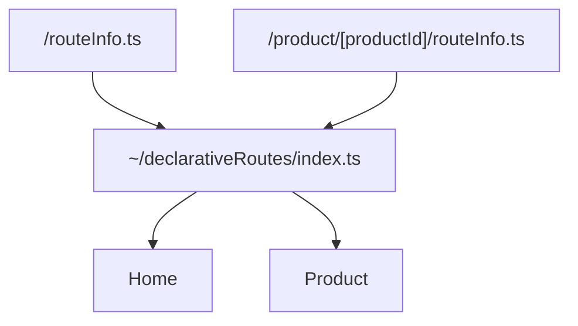
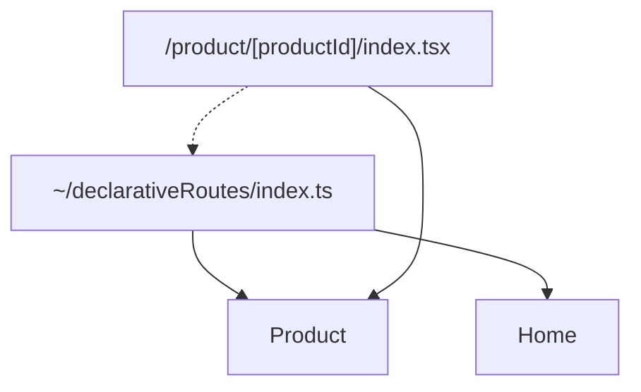
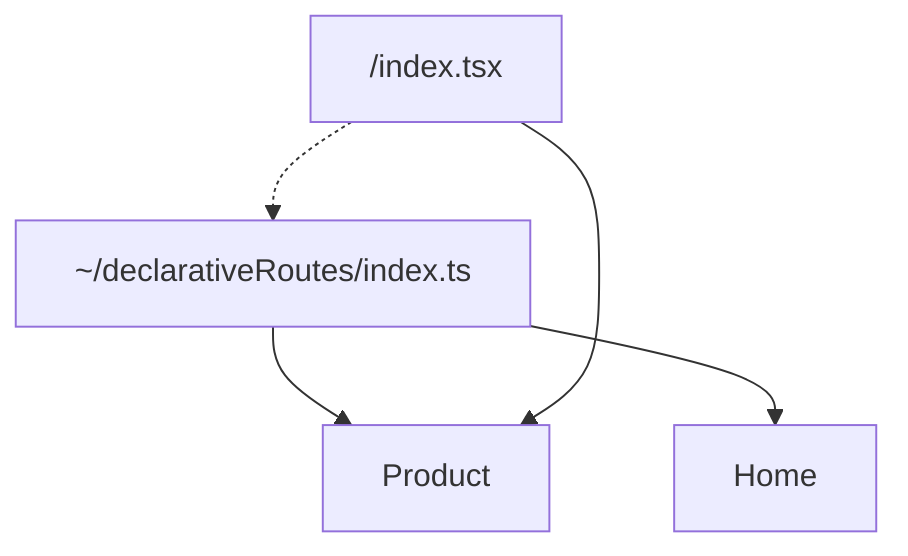

## Installation and Usage on QwikCity

Initialize your QwikCity application:

```bash
npx declarative-routing init
```

This will generate an `~/declarativeRoutes` directory that you can use to navigate to pages. It also generates a `README.md` file in the routes directory that contains information about how to use the system.

You can update the files when the route paths change using the `build` command. This will update the `~/declarativeRoutes` directory to reflect the new paths. For example, if you add a new page, you can run the following command to update the routes:

```bash
npx declarative-routing build
```

## Using Links To Pages Routes

Instead of doing this:

```tsx
import { Link } from "@builder.io/qwik-city";

<Link href={`/product/${product.id}`}>Product</Link>;
```

You can do this:

```tsx
import { ProductDetail } from "~/declarativeRoutes";

<ProductDetail.Link productId={product.id}>Product</ProductDetail.Link>;
```

## Opt-in

This system is opt-in. You can use it for some routes, and not for others. You can use it for some parts of your application, and not for others. It's designed to be flexible and to work with your existing code, and to be incrementally adoptable.

# How it works

Routes are typed using one or more of the methods defined in `~/declarativeRoutes/makeRoute`.

- `makeRoute` - Used for defining page routes

## makeRoute

`makeRoute` is used to define a page route. It takes the path of the route as a string, and an `info` object that contains the name of the route, as well as the Zod schemas for the route parameters and search parameters. Here is an example usage:

```tsx
const ProductDetail = makeRoute("/product-detail/[productId]", {
  name: "ProductDetail",
  params: z.object({
    productId: z.string()
  }),
  search: z.object({
    q: z.string().optional()
  })
});
```

The returned `ProductDetail` is a function that when invoked with the params and search parameters, returns the URL of the route. Shown below is an example usage:

```tsx
<Link href={ProductDetail({ productId: "abc123" }, { q: "foo" })}>
  Product abc123
</Link>
```

In addition to the function, the `ProductDetail` object also contains a `Link` component that can be used to link to the route. Shown below is an example usage:

```tsx
<ProductDetail.Link productId={"abc123"} search={{ q: "foo" }}>
  Product abc123
</ProductDetail.Link>
```

There is also a `ParamsLink` component that can be used to link to the route using an explicit `params` object for the params. Shown below is an example usage:

```tsx
<ProductDetail.ParamsLink
  params={{ productId: "abc123" }}
  search={{ q: "foo" }}
>
  Product abc123
</ProductDetail.ParamsLink>
```

## The manual option

You can choose to simply use the `makeRoute` functions wherever you choose to define routes.

## The `build` option

The automated option is to use the `build` command to generate the routes. This command will generate the routes for you based on the `index.tsx` files in your `.src/routes/` directory. For each `index.tsx` file it will generate a corresponding `routeInfo.ts` file in the same directory.

It will then import those `routeInfo.ts` files into `~/declarativeRoutes/index.ts` so that you can import all the routes from `~/declarativeRoutes` and use them in your application. Inside `~/declarativeRoutes/index.ts` it will generate `makeRoute` invocations for each of the page routes.

The /declarativeRoutes/index.ts file imports the `routeInfo.ts` files and exports routes.



Components then import the `~/declarativeRoutes` module and use the routes to navigate to pages.



For example in this case the `ProductPage` component imports the `Product` page route and uses that to type its parameters.

And the home page route:



Just imports the `Product` route from `~/declarativeRoutes` and uses that to build links to the product pages.

## Manually editing `routeInfo.ts` files

The `routeInfo.ts` files are meant to be manually edited.

For standard `routeInfo.ts` files you will need to manually edit them to add a `search` schema if the page supports search parameters.

## What are `routeInfo.ts` files?

The `routeInfo.ts` files are used to provide additional information about the routes. For all route types they provide the name of the route (which must be a valid Javascript variable name), the typed route parameters, and the optional route search parameters.

We put the `routeInfo.ts` files in the same directory as the `index.tsx` files so that we can keep all the information about a route in one place. It's the `build` command that creates `routeInfo.ts` files if they are missing, as well as maintains the `index.ts` file in `~/declarativeRoutes` that has all the routes.

Why not put all that information into the `index.tsx` files directly you ask?

1. The `index.ts` file in the `~/declarativeRoutes` directory imports all the `routeInfo.ts` files from all the routes. If we imported all the `index.tsx` files directly then we would defeat any code splitting that QwikCity does. By importing the `routeInfo.ts` files, we can ensure that the flow of imports is uni-directional. The `index.ts` file imports all the `routeInfo.ts` files, and all the `index.tsx` files import the `index.ts` file. This ensures that the `index.ts` file is the root of the import tree, and that the `index.tsx` files are only imported when they are needed.

## Why not copy the zod schemas into the `~/declarativeRoutes/index.ts` file?

That would require running the `build` process continuously to keep the `~/declarativeRoutes/index.ts` file up to date. We want to avoid that because it would slow down the development process. We only want to run the `build` process when we know that the routes have been added, or moved.

In the current model you can add search parameters, and the `~/declarativeRoutes/index.ts` file will not need to be updated. It will only need to be updated when the route paths change.

# Why is `makeRoute` copied into the `~/declarativeRoutes` directory?

You **own** this routing system once you install it. And we anticipate as part of that ownership you'll want to customize the routing system. That's why we create a `makeRoute.tsx` file in the `@routes` module. This file is a copy of the `makeRoute.tsx` file from the `declarative-routing` package. You can modify this file to change the behavior of the routing system.

For example, you might want to change the way the `Link` component works. You can do all of that by modifying the `makeRoute.tsx` file.

We do **NOT** recommend changing the parameters of the `makeRoute` function because that would cause incompatibility with the `build` command of `declarative-routing`.
